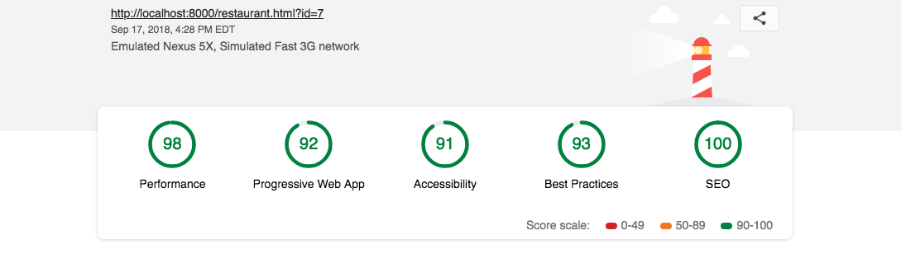

# Mobile Web Specialist Certification Course
---
#### _Three Stage Course Material Project - Restaurant Reviews_

<p align="center">
	</img>
</p>

## Project Overview: Stage 3

For the **Restaurant Reviews** projects, you will incrementally convert a static webpage to a mobile-ready web application. In **Stage Three**, you will take the connected application you built in **Stage One** and **Stage Two** and add additional functionality. You will add a form to allow users to create their own reviews. If the app is offline, your form will defer updating to the remote database until a connection is established. Finally, you’ll work to optimize your site to meet even stricter performance benchmarks than the previous project, and test again using [Lighthouse](https://developers.google.com/web/tools/lighthouse/).

## Getting Started

### Development local API Server, cd into server, and follow the instructions below:
_Location of server = /server_
Server depends on [node.js LTS Version: v6.11.2 ](https://nodejs.org/en/download/), [npm](https://www.npmjs.com/get-npm), and [sails.js](http://sailsjs.com/)
Please make sure you have these installed before proceeding forward.

Great, you are ready to proceed forward; awesome!

Let's start with running commands in your terminal, known as command line interface (CLI)

###### Install project dependancies
```Install project dependancies
npm i
```
###### Install Sails.js globally
```Install sails global
npm i sails -g
```
###### Start the server
```Start server
node server
```
### You should now have access to your API server environment
debug: Environment : development
debug: Port        : 1337

## Endpoints

### GET Endpoints

#### Get all restaurants
```
http://localhost:1337/restaurants/
```

#### Get favorite restaurants
```
http://localhost:1337/restaurants/?is_favorite=true
```

#### Get a restaurant by id
```
http://localhost:1337/restaurants/<restaurant_id>
```

#### Get all reviews for a restaurant
```
http://localhost:1337/reviews/?restaurant_id=<restaurant_id>
```

#### Get all restaurant reviews
```
http://localhost:1337/reviews/
```

#### Get a restaurant review by id
```
http://localhost:1337/reviews/<review_id>
```

#### Get all reviews for a restaurant
```
http://localhost:1337/reviews/?restaurant_id=<restaurant_id>
```

### POST Endpoints

#### Create a new restaurant review
```
http://localhost:1337/reviews/
```

###### Parameters
```
{
    "restaurant_id": <restaurant_id>,
    "name": <reviewer_name>,
    "rating": <rating>,
    "comments": <comment_text>
}
```


### PUT Endpoints

#### Favorite a restaurant
```
http://localhost:1337/restaurants/<restaurant_id>/?is_favorite=true
```

#### Unfavorite a restaurant
```
http://localhost:1337/restaurants/<restaurant_id>/?is_favorite=false
```

#### Update a restaurant review
```
http://localhost:1337/reviews/<review_id>
```

###### Parameters
```
{
    "name": <reviewer_name>,
    "rating": <rating>,
    "comments": <comment_text>
}
```


### DELETE Endpoints

#### Delete a restaurant review
```
http://localhost:1337/reviews/<review_id>
```


### What do I do from here? cd into client, and follow the instructions below:

1. In this folder, start up a simple HTTP server to serve up the site files on your local computer. Python has some simple tools to do this, and you don't even need to know Python. For most people, it's already installed on your computer. 

In a terminal, check the version of Python you have: `python -V`. If you have Python 2.x, spin up the server with `python -m SimpleHTTPServer 8000` (or some other port, if port 8000 is already in use.) For Python 3.x, you can use `python3 -m http.server 8000`. If you don't have Python installed, navigate to Python's [website](https://www.python.org/) to download and install the software.

2. With your server running, visit the site: `http://localhost:8000`, and look around for a bit to see what the current experience looks like.

- Converted to pull data from external Sails server
- Added use of IndexedDB to store JSON data for offline first, network second
- Added J. Archibald's IndexedDB Promise library
- Added manifest.json plus icons for PWA



**Lighthouse Audit Score - Minimum Specifications**
- PWA > 90
- Performance > 90
- Accessibility > 90

**Lighthouse Audit Settings**
Using Chrome - Lighthouse Extension
   1. Device: Mobile
   2. Audits: Performance, Progressive Web App, Accessibility
   3. Throttling: Simulated Fast 3G, 4x CPU Slowdown

**Audit Results Using Above**
Restaurant:
With throttling, the scores results are as follows:
- Performance =  98
- PWA = 92
- Accessibility = 91

Withouth throttling, the scores results are as follows:
- Performance = 100
- PWA = 92
- Accessibility = 91

Index:
With throttling, the scores results are as follows:
- Performance =  97
- PWA = 92
- Accessibility = 100

Withouth throttling, the scores results are as follows:
- Performance = 100
- PWA = 92
- Accessibility = 100


